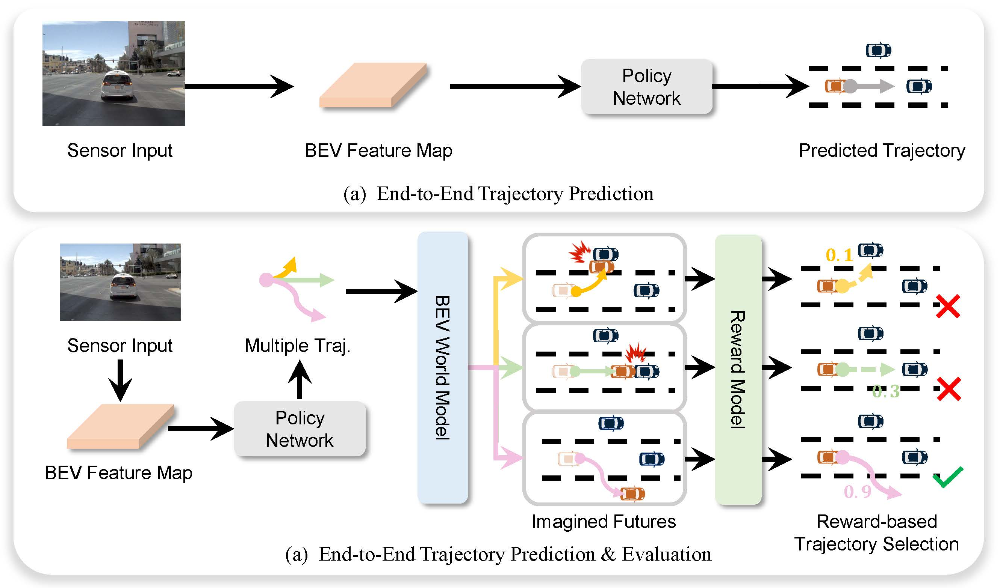

# 🚗 End-to-End Driving with Online Trajectory Evaluation via BEV World Model (ICCV2025)

Yingyan Li*, Yuqi Wang*, Yang Liu, Jiawei He, Lue Fan† and Zhaoxiang Zhang†
[[📄 Paper (arXiv:2504.01941)]](https://arxiv.org/abs/2504.01941)

We present **WoTE**, an end-to-end autonomous driving framework that leverages a BEV-based world model to predict future agent states, enabling online trajectory evaluation and selection.

<p align="center">
  
</p>

---
## 📊 1. Results & Checkpoints

| Method     | NC   | DAC  | EP   | TTC  | Comfort | PDMS | Training Time | GPU Memory | Checkpoint |
|:----------:|:----:|:----:|:----:|:----:|:-------:|:----:|:--------------:|:-----------:|:----------:|
| **WoTE**   | **98.5** | **96.8** | **81.9** | **94.9** | **99.9**  | **88.3** | **3 hrs** | **22 GB**   | [📥 Download](https://drive.google.com/drive/folders/1dIHK8nXkzhIhGCRQOpKibaizwH-7fHqs?usp=sharing) |

*Training conducted on 8 NVIDIA L20 GPUs.*  


> **Legend**  
> • NC: No Collision  
> • DAC: Drivable Area Compliance  
> • EP: Ego Progress  
> • TTC: Time to Collision  
> • Comfort: Comfort
> • PDMS: Predictive Driver Model Score

---


## 📦 2. Dataset & File Structure

```bash
root/
├── ckpts/
│   └── resnet34.pth
├── dataset/
│   ├── maps/
│   ├── navsim_logs/
│   │   ├── test/
│   │   └── trainval/
│   ├── sensor_blobs/
│   │   ├── test/
│   │   └── trainval/
│   └── extra_data/planning_vb/
│       ├── trajectory_anchors_256.npy
│       └── formatted_pdm_score_256.npy
└── exp/
    └── metric_cache/
```

### 📁 a. Download NAVSIM Dataset

To obtain the [navsim dataset](https://github.com/autonomousvision/navsim/tree/main):

```bash
bash download/download_maps.sh
bash download/download_navtrain.sh
bash download/download_test.sh
```

### 📁 b. Prepare Extra Data

You can either download the extra data directly from [🌐 Google Drive](https://drive.google.com/drive/folders/1dIHK8nXkzhIhGCRQOpKibaizwH-7fHqs?usp=sharing) or generate the files manually:

- **K-means anchor trajectories** (`trajectory_anchors_256.npy`):

```bash
python scripts/miscs/k_means_trajs.py
```

- **Reward generation** (`formatted_pdm_score_256.npy`):

```bash
bash scripts/miscs/gen_pdm_score.sh
```

### 📁 c. Precompute Metric Cache

```bash
bash scripts/evaluation/run_metric_caching.sh
```

---

## ⚙️ 3. Installation

Create the conda environment:

```bash
conda env create -f environment.yml
conda activate wote
```

Install dependencies:

```bash
pip install -r requirements.txt
pip install git+https://github.com/motional/nuplan-devkit.git@nuplan-devkit-v1.2#egg=nuplan-devkit
```

Add environment variables to `~/.bashrc` (modify paths as needed):

```bash
export NUPLAN_MAP_VERSION="nuplan-maps-v1.0"
export NUPLAN_MAPS_ROOT="$HOME/navsim_workspace/dataset/maps"
export NAVSIM_EXP_ROOT="$HOME/navsim_workspace/exp"
export NAVSIM_DEVKIT_ROOT="$HOME/navsim_workspace/"
export OPENSCENE_DATA_ROOT="$HOME/navsim_workspace/dataset"
```

---

## 🚀 4. Training & Evaluation

Update paths in:

```
navsim/agents/WoTE/configs/default.py
```

Then launch training:

```bash
bash scripts/training/run_wote.sh
```

Evaluation:
```bash
bash scripts/evaluation/eval_wote.sh
```
---


---

## 🔍 5. More from Us

If you're interested in **world models** for autonomous driving, feel free to check out our related work:

- [**LAW (ICLR 2025)**](https://github.com/BraveGroup/LAW): Using latent world models for self-supervised feature learning in end-to-end autonomous driving.
